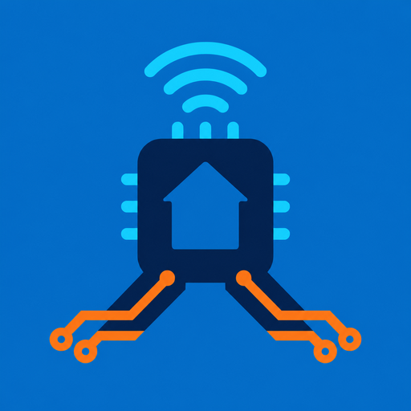

# SCSGATE



Home Assistant custom integration for ESP32_SCSGATE firmware `VER_7.004`.
It keeps the firmware's native MQTT Discovery entities and adds safe gateway
setup, diagnostics, device census, and guarded HTTP administration.

> The gateway HTTP server has no active authentication and sends configuration
> values through plain HTTP GET requests. Keep it on a trusted LAN/VLAN. Never
> expose it to the Internet.

## Features

- Gateway, firmware, Wi-Fi, and MQTT diagnostics.
- Guided MQTT device census and Discovery republish.
- Manual device naming, type selection, and cover calibration.
- Transient MQTT/Wi-Fi configuration; Home Assistant never stores passwords.
- Guarded gateway/PIC reset, callback, and firmware tools.
- Opt-in raw SCS telegram service with strict validation and confirmation.
- No duplicate `light`, `switch`, or `cover` entities: native MQTT owns them.

## Install and configure

The integration UI is available in English (default), Catalan, Spanish, and
Italian.

This repository is public and passes the official HACS validation. In HACS,
open **Custom repositories**, add `https://github.com/Assidefok/SCSGATE` as an
**Integration**, install SCSGATE, and restart Home Assistant. Then go to
**Settings > Devices & services > Add integration**, select **SCSGATE**, and
enter the gateway's private LAN IP address and HTTP port.

See the [installation and troubleshooting guide](docs/installation.md) for
manual installation, upgrades, recovery, and safe debug logging.

## Safety model

- Safe reads and MQTT republish are direct actions.
- Census, network changes, EEPROM clearing, processor resets, and PIC
  programming use explicit confirmation flows.
- Wi-Fi and MQTT passwords exist only for the duration of the submitted form.
- Raw SCS telegrams are disabled by default and require `confirm: true`.
- There is no generic HTTP passthrough service.

See [HTTP API coverage](docs/http-api.md) for the firmware route matrix and
[the primary sources](docs/research/scsgate-primary-sources.md) for the
firmware/manual versions used by this integration.

## Diagnostics and safe debug logging

Download a redacted diagnostic file from **Settings > Devices & services >
SCSGATE > Download diagnostics**. It excludes the gateway address and MAC,
Wi-Fi SSID, broker details, callbacks, credentials, and device snapshots while
including secret-free HTTP counters and the last operation result.

For temporary debug logging, add this to `configuration.yaml` and restart Home
Assistant:

```yaml
logger:
  default: info
  logs:
    custom_components.scsgate: debug
```

Debug messages include operation IDs, endpoint paths, HTTP status, duration,
response length, parser counts, census progress, and maintenance actions. They
never include hosts, query strings, response bodies, device names, callbacks,
SSIDs, broker addresses, usernames, or passwords. Remove the override after
troubleshooting to reduce log volume.

For deeper firmware troubleshooting, enable **Safe protocol analysis** under
the integration's **Advanced options**. It inspects every successful HTTP
response in memory and detects empty or oversized pages, control characters,
missing status/device markers, structural field counts, and changing HTML
shapes. It retains only the latest 25 secret-free observations in memory and
exports them through diagnostics; raw response content and values are discarded
immediately. Disable it after reproducing the problem.

### Bus activity viewer and guided device learning

Enable **Bus activity monitor** in **Configure > Advanced** to keep a bounded,
volatile capture of `scs/#`, `SCSERROR`, and, when supported by the firmware,
`SCSLOG`. The **Bus monitor** sensor shows safe counters. To view the captured
messages, run `scsgate.export_bus_log` from Developer Tools > Actions with the
entry ID and `confirm: true`; use `scsgate.clear_bus_log` when finished.

Message contents never enter entity state, normal diagnostics, or Home
Assistant's persistent log. The capture covers the broker-wide `scs` namespace,
so it cannot attribute messages to one gateway when several gateways share the
same broker. Stock firmware 7.004 compiles its raw
UART `SCSLOG` publisher out; on that build the viewer shows interpreted MQTT
activity, not every electrical bus telegram.

**Add new SCS devices** opens a three-step wizard. It snapshots existing bus
IDs, asks for the expected number of new devices, guides the physical bus
actions, and compares the final table with the baseline. Missing devices default
to rescan or in-wizard manual addition; acceptance stops learning before MQTT
Discovery is republished. Firmware 7.004 has no cover-only census, so covers
still require a global scan with explicit UP/STOP/DOWN actions.

### Advanced TCP/PIC capture

For firmware 7.004 low-level diagnosis, enable **Advanced TCP/PIC debug** under
**Configure > Advanced**. This feature is disabled by default. It temporarily
uses the gateway's only unauthenticated TCP client on port 5045, switches the
PIC log to ASCII/full-frame mode, retains a bounded in-memory capture, and
automatically restores the stock `@MX`, `@Y1`, `@F3`, `@l` settings.

Start it from **Developer Tools > Actions** with
`scsgate.start_advanced_debug` and confirmation `DEBUG <gateway identifier>`.
Use `scsgate.stop_advanced_debug` to stop early,
`scsgate.export_advanced_debug` to view the volatile messages, and
`scsgate.clear_advanced_debug` to erase them. If the connection is interrupted,
the diagnostic sensor reports `restore_required`; run
`scsgate.recover_advanced_debug` with `RECOVER <gateway identifier>`.

The capture can expose device addresses and occupancy. Use it only on a trusted
LAN, never expose port 5045 to the Internet, and do not run another TCP client
at the same time. It is a read-only fixed workflow, not a TCP terminal and not
an SCS transmit service.

## Development

```bash
python -m pip install --upgrade pip
python -m pip install -r requirements_test.txt
ruff check .
python -m pytest
```

## Contributing

Bug reports, firmware compatibility reports, feature requests, and pull
requests are welcome. Start with [CONTRIBUTING.md](CONTRIBUTING.md) and use the
structured GitHub issue forms. Never attach unredacted gateway pages, URLs,
credentials, diagnostics, MAC/IP addresses, or MQTT/Wi-Fi configuration.

## Credits

Based on the ESP32_SCSGATE firmware and documentation by papergion. SCSGATE,
SCS, and BTicino/Legrand product names belong to their respective owners.
